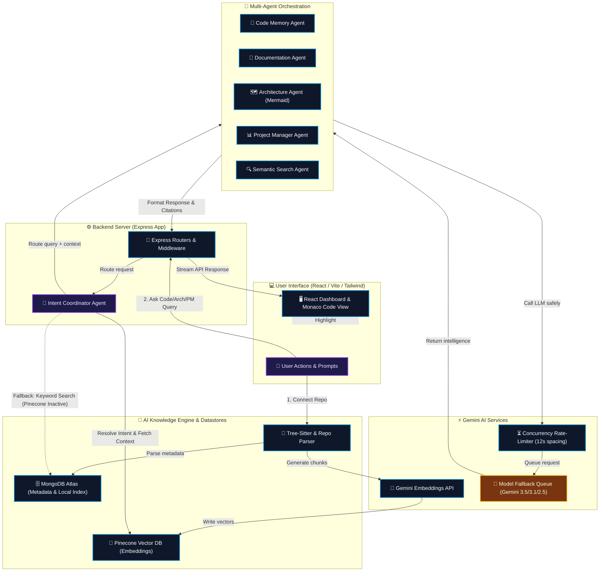

# 🧠 RepoMind

### *AI-Powered Engineering Memory & Project Intelligence Platform*

[](https://github.com)
[](https://github.com)
[](https://ai.google.dev/)

RepoMind is designed to act as the permanent engineering memory of a software project. It is a collaborative AI Engineering Assistant that indexes your entire repository to help you understand architecture, search code, generate documentation, audit security, and plan sprints.

---

## 🧭 Table of Contents
1. [The Actual Problem](#-the-actual-problem)
2. [The Solution: How RepoMind Solves It](#-the-solution-how-repomind-solves-it)
3. [Core Feature & UI Showcase](#-core-feature--ui-showcase)
4. [Multi-Agent Orchestration & Communication](#-multi-agent-orchestration--communication)
5. [Production-Grade Smoothness & Reliability](#-production-grade-smoothness--reliability)
6. [System Workflow Diagram](#-system-workflow-diagram)
7. [Tech Stack](#-tech-stack)
8. [Getting Started & Local Setup](#-getting-started--local-setup)

---

## ⚠️ The Actual Problem

As codebases grow, engineering knowledge fragments. Developers waste a significant portion of their workdays navigating cognitive load and searching for context:
* **The Context-Switching Tax:** Developers jump between GitHub issues, pull requests, Slack chats, codebase files, outdated READMEs, and browser windows just to answer a simple question: *"Where is user authentication verified?"*
* **The "Returning Developer" Dilemma:** When returning to a codebase after months, developers spend hours re-learning:
  * Why a specific architecture pattern was implemented.
  * Which modules handle database transactions.
  * Which components are legacy or unused.
* **LLM Context Limitations:** Standard AI chatbots (ChatGPT, Claude, Gemini) only understand the snippets you manually copy and paste. They lack system-wide code context, lead to repetitive prompt setups, hallucinate unconfigured API endpoints, and have no long-term memory of project evolution.

---

## 💡 The Solution: How RepoMind Solves It

RepoMind transforms a static repository into an active **AI Engineering Teammate** with absolute codebase memory:
1. **Repository Synchronization:** Connects securely via GitHub OAuth to fetch branches, files, pull requests, issues, and commit histories.
2. **Deep Code Parsing:** Analyzes imports, routes, controllers, services, database models, and components.
3. **Semantic Vector Memory:** Converts files into text chunks and generates vector embeddings stored in a Pinecone database.
4. **Context-Aware Answers:** Answers every query using the retrieved indexed repository instead of model hallucination, citing actual files and line numbers with direct editor integration.

---

## 🎨 Core Feature & UI Showcase

* **🔐 GitHub OAuth Login:** Secure authorization flow returning JWT-protected sessions.
* **📊 Repository Dashboard:** Visually track repository statistics, project health, issue timelines, and database state.
* **💬 AI Chat with Monaco Code Viewer:** Speak directly to your codebase. If the AI references a file (e.g. `auth.js` line 45), clicking the citation automatically opens a **Monaco Code Editor** component in the browser, highlighting the exact line of code.
* **🗺️ Architecture Explorer:** Generates dynamic Mermaid.js sequence and entity-relationship diagrams illustrating routing flows, authentication cycles, and database relationships.
* **📝 Automated Documentation Generator:** One-click deployment of professional READMEs, API guides, installation procedures, and changelogs.
* **💼 Project Manager Dashboard:** Scours commit histories, issues, and TODO comments. Uses AI to prioritize tasks (`P0` to `P3` tags) and details rationales for sprint planning.

---

## 🤖 Multi-Agent Orchestration & Communication

RepoMind runs a **Coordinated Multi-Agent System** where tasks are processed by specialized agents under a central hub:

```
                          [ User Prompt ]
                                 │
                                 ▼
                     [ Coordinator Agent (Hub) ]
                                 │
         ┌───────────────────────┼───────────────────────┐
         ▼                       ▼                       ▼
 [ Code Memory Agent ]  [ Architecture Agent ]  [ Project Manager Agent ]
```

### 1. The Core Agents

* **🧠 Coordinator Agent:** Receives the raw user request, runs intent classification to identify target actions, retrieves vector context from the database, forwards tasks to the matching agent, formats responses, and builds citation references.
* **💾 Code Memory Agent:** Specializes in cross-module code explanations, syntax navigation, dependency flows, and architectural walkthroughs.
* **🗺️ Architecture Agent:** Responsible for mapping structural layouts and rendering live flow diagrams using Mermaid.js and ReactFlow.
* **📊 Project Manager Agent:** Analyzes the backlog, schedules sprints, extracts TODO lines from code, audits code quality, and performs developer performance summaries.
* **🔍 Semantic Search Agent:** High-speed code locator that queries vector databases to find semantic duplicates or specific system files.
* **📝 Documentation Agent:** Automatically drafts project modules, API guides, and setup steps tailored to the active folder structures.

### 2. How the Agents are Called (Backend Implementation)

* **Gateway Routing:** All actions hit dedicated Express routes in `backend/src/routes/` (e.g. `pm.routes.js`, `chat.routes.js`, `documentation.routes.js`).
* **System Layout Injection:** Before calling the model, the backend builds a dynamic **System Context Layout** aggregating metadata about active files, routes, controllers, services, and models. This layout is injected into the model instruction so that the LLM is fully aware of the architecture topology.
* **API Endpoints:**
  * `POST /api/pm/agent/run` (Runs file/system reviews, tests, security, or bug refactoring audits)
  * `GET /api/pm/:id/todos` (Harvests raw TODO annotations from code)
  * `POST /api/chat/:id` (Triggers RAG-based code memory queries)
  * `POST /api/documentation/generate` (Executes document generation cycles)

---

## ⚡ Production-Grade Smoothness & Reliability

RepoMind implements rigorous safety, rate-limiting, and state features to deliver a smooth, production-like experience:

### 1. Concurrency & Rate-Limit Shielding (`RateLimiter`)
To protect against Gemini free-tier rate limits (which restrict Requests Per Minute), the backend uses a custom **RateLimiter** queue (`backend/src/utils/limiter.js`):
* Spaces LLM calls by a strict minimum of **12 seconds** between consecutive requests.
* Rather than crashing, requests are scheduled and queued sequentially, guaranteeing reliable completion without hitting quota blockages.

### 2. Model-Fallback Routing Queue
To maximize uptime and API availability, RepoMind executes fallback loops across a prioritised array of Gemini models:
$$\text{gemini-3.5-flash} \longrightarrow \text{gemini-3.1-flash-lite} \longrightarrow \text{gemini-2.5-flash} \longrightarrow \text{gemini-2.0-flash}$$
If a model fails due to rate limits or region issues, the system catches the error and immediately retries using the next model in the queue.

### 3. Graceful No-Key & Rate-Limit Fallbacks
* **MongoDB Keyword Fallback:** If the Pinecone vector index is inactive, or if the `GEMINI_API_KEY` is not configured, the chat system switches to a **local keyword-regex indexing database search** in MongoDB. It returns files matching the keywords with clickable code links.
* **Dynamic Wait Time Estimator:** When hitting an external API rate limit (429 status code), the backend parses the retry header message to compute the exact delay (e.g., `60 seconds`), returning a user-friendly UI prompt with a recovery countdown.

### 4. Interactive & Animated UI Details
* **Framer Motion Transitions:** Smooth card transitions, slide-ins, and page entries.
* **ReactFlow Mindmaps:** The Landing page features a live, interactive ReactFlow-powered network tree showing repository components connected to the RepoMind core.
* **Typing indicators:** Dynamic bounce animations for incoming AI messages.

---

## 📊 System Workflow Diagram

The sequence flowchart below displays how codebase ingestion, user queries, vector search, and agent orchestration flow through the RepoMind platform:



---

## 🛠️ Tech Stack

* **Frontend:** React.js, Vite, TailwindCSS, Framer Motion, Monaco Editor (Code viewer), ReactFlow (Interactive networks), Mermaid.js (Diagrams), Axios.
* **Backend:** Node.js, Express, MongoDB Atlas, Pinecone DB, GitHub API & OAuth, Tree-sitter.
* **LLM Engine:** Gemini 3.5 Flash, Gemini Embeddings, custom rate-limiting queues.

---

## 🚀 Getting Started & Local Setup

### Prerequisites
* **Node.js** (v16.x or higher)
* **MongoDB** (Local instance or MongoDB Atlas cluster connection)
* **Pinecone Account** (For vector storage database)
* **GitHub OAuth App** (Created under Developer Settings on GitHub)
* **Gemini API Key** (Acquired from Google AI Studio)

---

### Backend Configuration

1. Navigate to the backend directory:
   ```bash
   cd backend
   ```
2. Install npm dependencies:
   ```bash
   npm install
   ```
3. Create a `.env` file from the example:
   ```bash
   cp .env.example .env
   ```
4. Fill in your environment credentials:
   ```env
   PORT=5000
   MONGO_URI=your_mongodb_connection_uri
   JWT_SECRET=your_jwt_signing_token
   GITHUB_CLIENT_ID=your_github_client_id
   GITHUB_CLIENT_SECRET=your_github_client_secret
   GITHUB_CALLBACK_URL=http://localhost:5173/auth/callback
   PINECONE_API_KEY=your_pinecone_api_key
   PINECONE_INDEX=your_pinecone_index_name
   GEMINI_API_KEY=your_google_studio_gemini_key
   ```
5. Launch the backend dev server:
   ```bash
   npm run dev
   ```

---

### Frontend Configuration

1. Navigate to the frontend directory:
   ```bash
   cd ../frontend
   ```
2. Install npm dependencies:
   ```bash
   npm install
   ```
3. Boot up the Vite dev server:
   ```bash
   npm run dev
   ```
4. Open [http://localhost:5173](http://localhost:5173) in your browser and log in with your GitHub account!

---

💡 *Developed by Nile & Antigravity IDE team. For queries or architecture details, launch RepoMind and ask: "Explain the codebase routing flow."*
